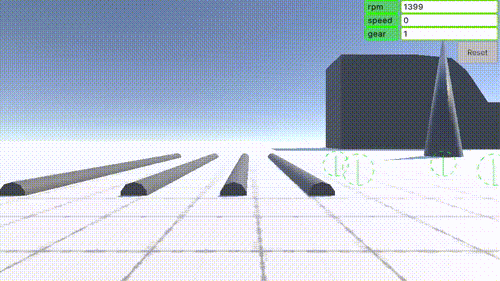

# TLabVehiclePhysics
An open source wheel collider sample project  
This project uses URP, but TLabVihiclePhysics itself can also be used in the built-in render pipeline

## Note
The repository is currently undergoing a destructive update, and in the process I updated the behavior of the car, so upload it once. The mod-compatible code has now been removed, so if you want to refer to it, please refer to the previous commitsgit  
The following is the commit ID before the destructive update ``` commit 61e21c8df167bc6b5320b4f8f5b2b4efc7cc58c2 ```

## Support
[](https://www.buymeacoffee.com/tlabaltoh)

## Screenshot
[You can play the demo here](https://tlab.itch.io/tlabvihiclephysics-mod)  

<table>
<tr>
   <td> 
      
   </td>
</tr>
</table>

<table>
<tr>
   <td> 
      
   </td>
</tr>
</table>

<table>
<tr>
   <td>
	    
	 </td>
</tr>
</table>

<table>
<tr>
   <td> 
      
   </td>
</tr>
</table>

## Getting Started
### Prerequisites
- Unity 2022.3.3f1 --> 2022.3.11f1
- UniversalRenderingPipeline
- ProBuilder

### Installing
Clone the repository to any directory with the following command  
```
git clone https://github.com/TLabAltoh/TLabVehiclePhysics.git
```

### WheelColiderSource
#### How to play
##### Car Operation
- Left / Right Arrow: Handle
- Up Arrow: Accelerator
- Down Arrow: Brake
- Q: Shift Up
- E: Shift Down
- C: Clutch
##### Camera Operation
- ASDW: Camera Rotation
- Z: Switch Camera (FPS / TPS)

## Reference
- https://github.com/JustInvoke/Randomation-Vehicle-Physics
- https://github.com/unity-car-tutorials/Unity5-WheelColliderSource

