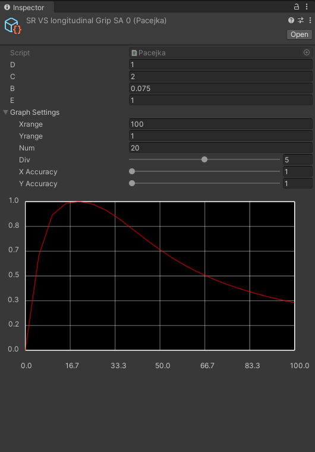
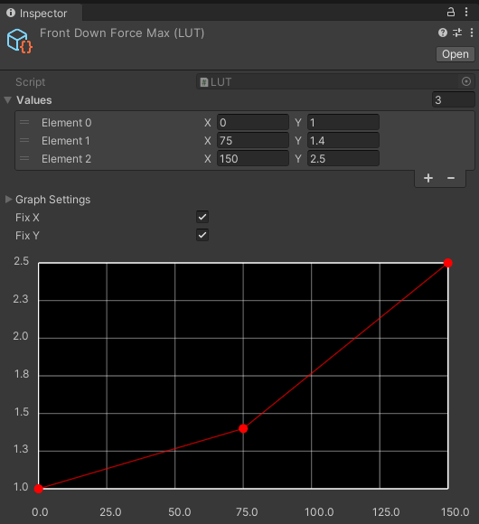
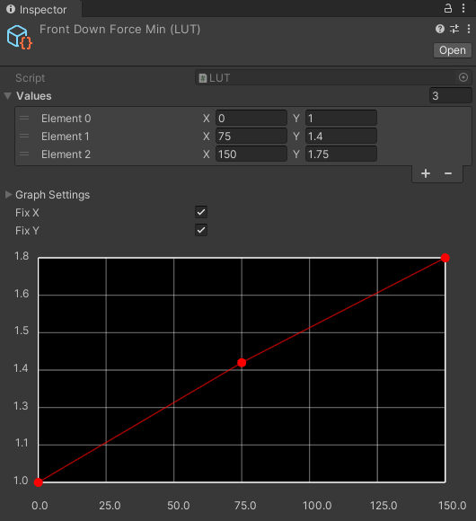
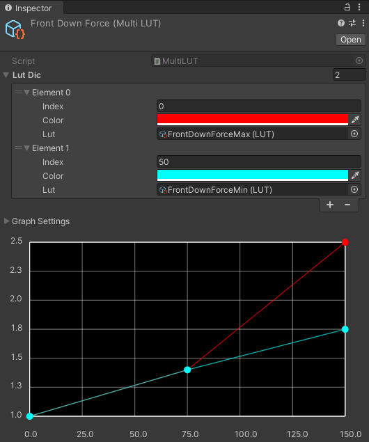

# TLabVehiclePhysics
Open Source WheelCollider for Unity. pacejka based wheel logic and utility for creating simple tire models.

## Support
[](https://www.buymeacoffee.com/tlabaltoh)

## Screenshot
<table>
    <caption>GamePlay Overview</caption>
    <tr>
        <td></td>
    </tr>
</table>

<details>

<summary>Example parameters used in this project</summary>
<table>
    <caption>Pacejka</caption>
    <tr>
        <td></td>
        <td></td>
        <td></td>
    </tr>
</table>
<table>
    <caption>Downforce and Torque Curve with LUT</caption>
    <tr>
        <td></td>
        <td></td>
    </tr>
    <tr>
        <td></td>
        <td></td>
    </tr>
</table>
</details>

## Getting Started
### Prerequisites
- 2022.3.19f1
- Universal Rendering Pipeline (URP)

### Installing
Clone the repository to any directory with the following command  
```
git clone https://github.com/TLabAltoh/TLabVehiclePhysics.git

cd TLabVehiclePhysics

git submodule upadte --init
```

### WheelColiderSource
#### How to play
##### Car Operation
- Left / Right Arrow: Handle
- Up Arrow: Accelerator
- Down Arrow: Brake
- Q: Shift Up
- E: Shift Down
- C: Clutch
##### Camera Operation
- ASDW: Camera Rotation
- Z: Switch Camera (Pov / Follow)

## Reference
- [Randomation-Vehicle-Physics](https://github.com/JustInvoke/Randomation-Vehicle-Physics)
- [Unity5-WheelCollider](https://github.com/unity-car-tutorials/Unity5-WheelColliderSource)

