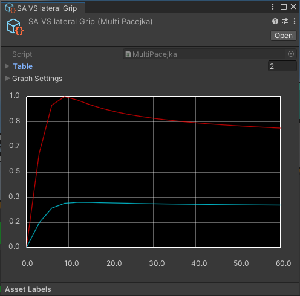
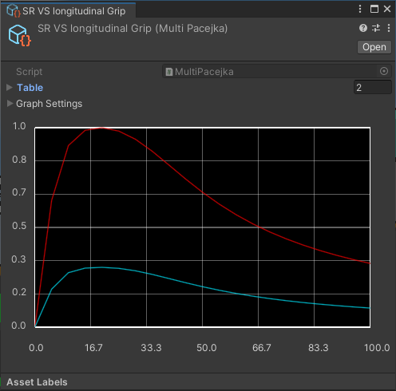

# TLabVehiclePhysics
Open Source WheelCollider for Unity. This project implements a pacejka based tire logic. 

[](https://www.buymeacoffee.com/tlabaltoh)

## Screenshot


<details><summary>Pacejka and LUT Tool</summary>
<table>
    <tr>
        <td></td>
        <td></td>
    </tr>
</table>
</details>

<details><summary>Physical parameters for vehicle</summary>
<table>
    <caption>Pacejka</caption>
    <tr>
        <td></td>
        <td></td>
    </tr>
</table>
<table>
    <caption>Downforce</caption>
    <tr>
        <td></td>
        <td></td>
    </tr>
</table>
<table>
    <caption>Torque Curve</caption>
    <tr>
        <td></td>
    </tr>
</table>
</details>

## Approach to tire physics implementation
This project uses [```Pacejka```](https://en.wikipedia.org/wiki/Hans_B._Pacejka) and ```LUT (Look up table)``` for the minimum physics parameter unit. And most of the physics parameters are culculated as interprate 2 parameters (```Pacejka```, ```LUT```) by additional ```float``` type parameters (```slip angle```, ```slip ratio```, ```yaw of vehicle``` etc ...) in order to behave vehicle as more complex. 

## Getting Started
### Prerequisites
- 2022.3.19f1
- Universal Rendering Pipeline (URP)

### Installing
Clone the repository to any directory with the following command  
```
git clone https://github.com/TLabAltoh/TLabVehiclePhysics.git

cd TLabVehiclePhysics

git submodule upadte --init
```

### How to play
- ```⇦ ⇨```: Handle
- ```⇧```: Accelerator
- ```⇩```: Brake
- ```Q```: Shift Up
- ```E```: Shift Down
- ```C```: Clutch
- ```ASDW```: Camera Rotation
- ```Z```: Switch Camera (```Pov``` / ```Follow```)

## Reference
- [Randomation-Vehicle-Physics](https://github.com/JustInvoke/Randomation-Vehicle-Physics)
- [Unity5-WheelCollider](https://github.com/unity-car-tutorials/Unity5-WheelColliderSource)

